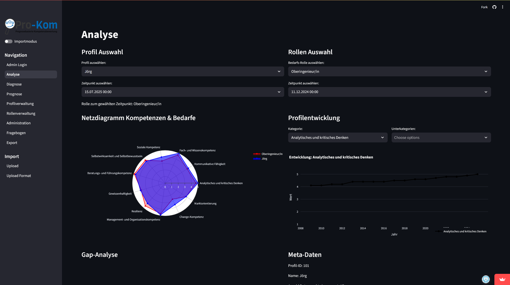

# Kompetenzmanagement App

A **Streamlit application** for analyzing, capturing, and managing team competencies.
The tool helps teams document skills, identify gaps, and generate diagnostic tables. This enables managers to create effective improvement plans.
With a user-friendly API, the app can be easily accessed and used by everyone.


## 📗 Table of Contents
* [Technologies Used](#technologie)
* [Features](#features)
* [Screenshots](#screenshots)
* [Installation](#Installation)
* [Project Status](#project-status)
* [Contact](#contact)


## 📚 Technologie
### This project was created using the following libraries:


* [![Streamlit][Streamlit.io]][Streamlit-url]
* [![Pandas][Pandas.pydata]][Pandas-url]
* [![NumPy][Numpy.org]][Numpy-url]
* [![pytz][Pytz.org]][Pytz-url]
* [![Plotly][Plotly.com]][Plotly-url]
* [![st-gsheets-connection][Gsheets-Conn]][Gsheets-Conn-url]
* [![streamlit_gsheets][Streamlit-Gsheets]][Streamlit-Gsheets-url]

[Streamlit.io]: https://img.shields.io/badge/Streamlit-FF4B4B?style=for-the-badge&logo=streamlit&logoColor=white
[Streamlit-url]: https://streamlit.io/

[Pandas.pydata]: https://img.shields.io/badge/Pandas-150458?style=for-the-badge&logo=pandas&logoColor=white
[Pandas-url]: https://pandas.pydata.org/

[Numpy.org]: https://img.shields.io/badge/NumPy-013243?style=for-the-badge&logo=numpy&logoColor=white
[Numpy-url]: https://numpy.org/

[Pytz.org]: https://img.shields.io/badge/pytz-003B57?style=for-the-badge
[Pytz-url]: https://pypi.org/project/pytz/

[Plotly.com]: https://img.shields.io/badge/Plotly-3F4F75?style=for-the-badge&logo=plotly&logoColor=white
[Plotly-url]: https://plotly.com/

[Gsheets-Conn]: https://img.shields.io/badge/st--gsheets--connection-0A66C2?style=for-the-badge
[Gsheets-Conn-url]: https://github.com/streamlit/gsheets-connection

[Streamlit-Gsheets]: https://img.shields.io/badge/streamlit__gsheets-0A66C2?style=for-the-badge
[Streamlit-Gsheets-url]: https://github.com/arnaudmiribel/streamlit-gsheets

--

- streamlit == 1.48.0
- pandas==2.3.1
- numpy==2.3.1
- pytz==2025.2
- plotly==6.2.0
- st-gsheets-connection==0.1.0
- scikit-learn==1.7.1
- streamlit_gsheets==0.1.3 hier muss ein githublink rein


---

## ⚙️ Configuration

In this project, **Google Sheets** is used as the primary database.
The connection is established using Streamlit’s `st.connection()` function in combination with the `secrets.toml` configuration file.

---

### 🔐 `secrets.toml`

This file securely stores all sensitive information such as API keys, database credentials, and configuration values.
It is stored **locally** on each user’s machine and is **not included** in the public repository for security reasons.

#### Example Structure

```
# .streamlit/secrets.toml

[connections.gsheets]
spreadsheet = "https://docs.google.com/spreadsheets/d/xxxxxxx/edit#gid=0"

# From your JSON key file
type = "service_account"
project_id = "xxx"
private_key_id = "xxx"
private_key = "xxx"
client_email = "xxx"
client_id = "xxx"
auth_uri = "https://accounts.google.com/o/oauth2/auth"
token_uri = "https://oauth2.googleapis.com/token"
auth_provider_x509_cert_url = "https://www.googleapis.com/oauth2/v1/certs"
client_x509_cert_url = "xxx"

[credentials]
# Define username and password here, for example:
admin1234 = "56789"
```

📝 **Notes:**

* Under `[connections.gsheets]`, insert the **private Google Sheets link** you want the app to use.
* To create your **JSON key file**, please follow the official Streamlit documentation [here](https://docs.streamlit.io/develop/tutorials/databases/private-gsheet).

---

### 🔌 Data Connection

This application connects securely to Google Sheets using Streamlit’s built-in `st.connection()` API.
All connection details — including spreadsheet URLs and service account credentials — are stored inside the `.streamlit/secrets.toml` file to ensure sensitive data remains private and version-controlled safely.

The connection is initialized with:

```
conn = st.connection("gsheets", type=GSheetsConnection)
```

This line tells Streamlit to look for a configuration block named `[connections.gsheets]` inside your `secrets.toml` file.
That section defines the data source (Google Sheets) and the authentication method (service account).

⚠️ **Important:**
The connection name `"gsheets"` **must exactly match** the name in your `secrets.toml`.
If you rename `[connections.gsheets]` to something else (e.g. `[connections.mydata]`), you must also update your code accordingly:

```python
st.connection("mydata", type=GSheetsConnection)
```

Otherwise, the app will not find the connection and may fail to start.

📁 **Worksheet Configuration:**
If your Google Sheet contains multiple worksheets with different names, make sure the worksheet paths are correctly updated in `config.py` to match each specific sheet.


## ⚙️ Installation
1. Clone the Repo
   ```sh
   git clone https://github.com/TimsGitH/Kompetenzmanagement
   ```

2. Install the requirements

   ```
   $ pip install -r requirements.txt
   ```

3. Run the app

   ```
   $ streamlit run analyse_app.py

   or navigate to testrun.py and click on "Run Python File"
   ```


## 📘 Features

### Analyse
Compare individual competence profiles with organizational needs. Profile development over time is visualized for a clear and intuitive analysis.

### Diagnose
Track and compare the development of roles and their required skills. A correlation table is generated to ensure transparency and traceability.

### Prognose
Predict the future development of competence requirements and individual profiles. Improvement measures can be freely selected to support targeted skill development.

## 📷 Screenshots


## ⏳Project Status
The project is currently in a prototype stage, but it is actively maintained and supported.  
We are also open to developing it further based on your individual requirements.

## ☎️ Contact

Your Name - [@your_twitter](https://twitter.com/your_username) - email@example.com

Project Link: [https://github.com/TimsGitH/Kompetenzmanagement](https://github.com/TimsGitH/Kompetenzmanagement)